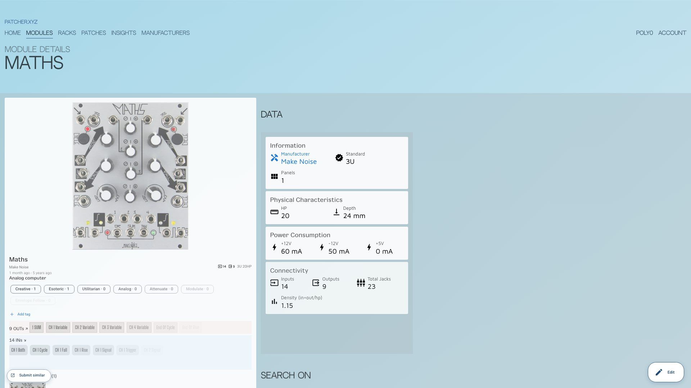
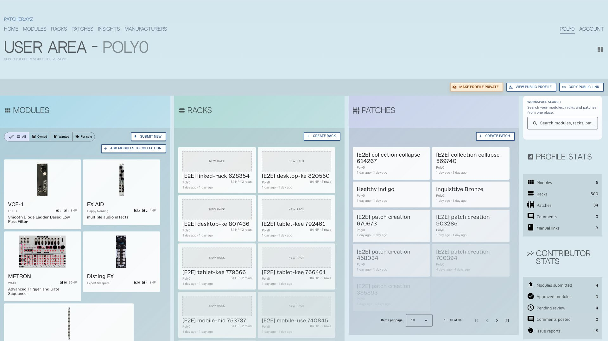

<p align="center">
  
</p>
<p align="center">
  
</p>

<br>

<h2 align="center">The digital twin workspace for Eurorack musicians.</h2>
<p align="center">Document patches, plan racks, track modules, and keep your real system in sync with a fast, clean workflow.<br>
<a href="https://patcher.xyz">patcher.xyz</a> &nbsp;·&nbsp; <a href="https://discord.gg/N6Z32xJR">Discord</a> &nbsp;·&nbsp; <a href="CHANGELOG.md">Changelog</a></p>

<br>

---

<br>

## New since v5.0

- **Instance-aware patching** for repeated modules.
- **Auto-save** for patch state and edits.
- **Power analysis** and **balance analysis** in rack detail.
- **Multi-panel module support** with panel gallery improvements.
- **Public profiles**, contributor stats, and better discovery tooling.

See the full [CHANGELOG](CHANGELOG.md) for details.

<br>

---

<br>

### Feedback & bug reports

Have an idea or found something broken? Come talk to us on [Discord](https://discord.gg/N6Z32xJR) — it's the fastest way
to reach the team and the right place for feature discussions.

Technical bug reports can also be opened as [GitHub issues](https://github.com/Polyterative/Patcher/issues).

<br>
<br>

## **Table of Contents**

1. [**Introduction**](#introduction)
2. [**Why Patcher?**](#why-patcher)
3. [**User Guide**](#user-guide)
4. [**Setting Up the Project Locally**](#setting-up-the-project-locally)
5. [**Running E2E Tests**](#running-e2e-tests)
6. [**Project Dependencies**](#project-dependencies)
7. [**DB Model Details**](#db-model-details)
8. [**Pull Requests**](#pull-requests)
9. [**License**](#license)
10. [**AI & Open Data Stance**](#ai--open-data-stance)

---

## **Introduction**

**Patcher** is a free, open-source workspace for Eurorack musicians. It combines patch editing, rack planning, module
tracking, and a curated public hardware database so you can maintain a reliable digital twin of your real setup.

The database is publicly accessible and will always remain free. No paywalls, no account required to browse.

Contributions are welcome — whether that's code, module data, or feedback.

## **Why Patcher?**

Patcher is built for the full modular workflow, not just patch notes.

### At a glance

- Keep a digital twin of your real rig: patches, racks, modules, notes, and connection state.
- Plan racks quickly with drag-and-drop placement.
- Move fast with streamlined connection flow and app-wide auto-save.
- Read complexity quickly with live stats for cables, modules, and multiples.

### Why it stays useful

- Works on desktop and mobile with the same workflow.
- Public/private controls for patches and racks.
- Free, publicly accessible Eurorack module database with community-curated specs.
- Modern UX built for everyday use, not just collection storage.

## **User Guide**

👉 **[Read the User Guide](USER_GUIDE.md)** for end-user workflows:

- Module discovery and filtering
- Patch creation/editing and notes
- Rack planning and collection management

---

## **Setting Up the Project Locally**

Use pnpm for dependency management:

```bash
git clone <repository_url>
cd Patcher
pnpm install
pnpm start
# use SSR locally only when you need to debug SSR-specific behavior
pnpm start:ssr
```

Local app URL: `http://localhost:5556/`

> **Branches:** `develop` is where active work happens. `production` is deployed automatically — do not push to it
> directly.

---

## **Local Supabase Backups**

- Inspect the read-only backup commands first: `pnpm backup:data:dry-run`
- Create a local backup snapshot: `pnpm backup:data`
- Restore a backup on purpose: `pnpm restore:data -- backups/data_YYYY-MM-DD_HH-MM-SS.sql`

Notes:

- `pnpm backup:data` uses local `pg_dump`, so the remote database is read-only during backup.
- Backup uses the linked Supabase project from your authenticated CLI session.
- Install local Postgres client tools first if needed: `brew install postgresql@16`
- Backup files are written to `./backups/`, and that directory is gitignored because this repository is public.
- The backup script refuses to run if git is not ignoring `backups/`.
- Restore is intentionally separate, requires `SUPABASE_DB_URL`, and asks for explicit confirmation before writing.

---

## **Running E2E Tests**

- Public smoke suite: `pnpm test:e2e`
- Authenticated suite: `pnpm test:e2e:auth`

For contributor setup (required `.env` keys, dedicated test account, and why `playwright/.auth/` is ignored), see
[`e2e/README.md`](e2e/README.md).

---

## **Project Dependencies**

The project uses the following tools and libraries:

| **Tool/Library**       | **What**                                                             |
|------------------------|----------------------------------------------------------------------|
| **Angular**            | Web framework. Using v18                                             |
| **Angular Material**   | UI components                                                        |
| **Supabase**           | Database, authentication, and storage                                |
| **Vercel**             | Deployment, hosting                                                  |
| **GitHub**             | Version control, issue tracking, project management, test automation |
| **Database**           | PostgreSQL hosted on Supabase                                        |
| **Sentry**             | Technical analytics and error tracking                               |
| **Other Dependencies** | Check the `package.json` file                                        |

---

## **DB Model Details**

The database model for the project is as follows:


---

## **Pull Requests**

Open pull requests on GitHub from your fork.

For faster review:

- Keep PRs small and focused.
- Split large changes into multiple PRs when possible.
- Submit foundational changes first, then follow-up work.

---

## **License**

This project is licensed under the **GNU Affero General Public License v3.0**. For more information, see the [LICENSE](LICENSE.txt) file.

---

## **AI & Open Data Stance**

Patcher is intentionally pro-open-data.

Public content on patcher.xyz is meant to be discoverable and reusable, including by AI systems. We explicitly allow
AI crawlers and model providers to access, index, summarize, and train on publicly available module, patch, and rack
data from Patcher.

We also actively use AI tools in this project ourselves. Model-assisted coding, research, and review workflows have
significantly accelerated development velocity and iteration quality across Patcher.

This applies only to content users have marked as public. Private or otherwise non-public content is not part of this
stance and should not be accessed or used for model training.

Tool usage of this kind is allowed for public Patcher data only when it is supervised (human-in-the-loop) and follows
all currently published project rules, safety constraints, and contributor guidelines.

Crawler guidance lives at [https://patcher.xyz/llms.txt](https://patcher.xyz/llms.txt) and in
[`src/llms.txt`](src/llms.txt).
