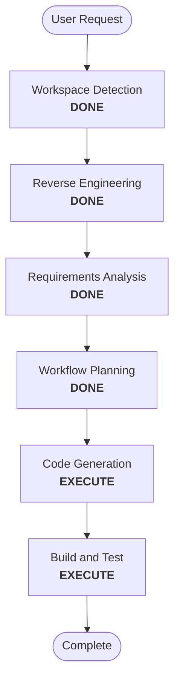

# Execution Plan

## Detailed Analysis Summary

### Transformation Scope
- **Type**: Single feature update inside the rack editor
- **Primary changes**: Stable `@for` tracking, local rack-state updates, backend refresh merge behavior
- **Related artifacts**: `internaldocs/workflow/CURRENT_FEATURE.md`, `internaldocs/workflow/plans/rack-granular-updates.md`

### Change Impact Assessment
- **User-facing changes**: Yes, rack edits stop flashing untouched modules
- **Structural changes**: Yes, but limited to the rack editor state flow
- **Data model changes**: No
- **API changes**: No
- **NFR impact**: Yes, mostly UI smoothness and regression safety

### Component Relationships
- **Primary component**: Rack editor visual model and detail data service
- **Supporting components**: rack utils, rack editor specs, module rendering
- **Dependent components**: drag/drop and add/remove/replace row flows

### Risk Assessment
- **Risk level**: Medium
- **Rollback complexity**: Moderate
- **Testing complexity**: Moderate

## Workflow Visualization

## Phases to Execute

### 🔵 INCEPTION PHASE
- [x] Workspace Detection
- [x] Reverse Engineering
- [x] Requirements Analysis
- [x] Workflow Planning
- [ ] User Stories - SKIP
  - **Rationale**: The active feature already has a focused implementation plan and no additional personas or acceptance-story split is needed.
- [ ] Application Design - SKIP
  - **Rationale**: The rack-granular plan already names the exact component/service/files to change.
- [ ] Units Planning - SKIP
  - **Rationale**: This is a single feature slice, not a multi-unit decomposition problem.
- [ ] Units Generation - SKIP
  - **Rationale**: No separate unit breakdown is needed beyond the existing feature layers.

### 🟢 CONSTRUCTION PHASE
- [ ] Functional Design - SKIP
  - **Rationale**: Business logic is already captured in the feature plan and requirements.
- [ ] NFR Requirements - SKIP
  - **Rationale**: The relevant NFRs are already scoped to UI stability, regression safety, and drag/drop preservation.
- [ ] NFR Design - SKIP
  - **Rationale**: No new cross-cutting architecture is being introduced.
- [ ] Infrastructure Design - SKIP
  - **Rationale**: No infrastructure or deployment changes are required.
- [ ] Code Generation - EXECUTE
  - **Rationale**: Implement the current feature plan in code.
- [ ] Build and Test - EXECUTE
  - **Rationale**: Verify the rack editor update flow and prevent regressions.

### 🟡 OPERATIONS PHASE
- [ ] Operations - PLACEHOLDER
  - **Rationale**: Not part of this feature.

## Estimated Timeline
- **Total executed stages**: 2
- **Estimated duration**: Short implementation cycle

## Success Criteria
- Unchanged modules keep their DOM nodes across rack mutations.
- Full rack reload flashes are removed from the targeted flows.
- Local row/module changes stay responsive.
- Existing rack editor tests continue to pass.

## Decision log
- 2026-06-11 — Skipped user stories and app design because the active feature plan already defines the exact component-level implementation and the user confirmed they want to continue the current feature first.
- 2026-06-11 — Skipped design/infrastructure construction stages because no new architecture or backend surface is being introduced; the work is a contained UI/state-flow correction.
