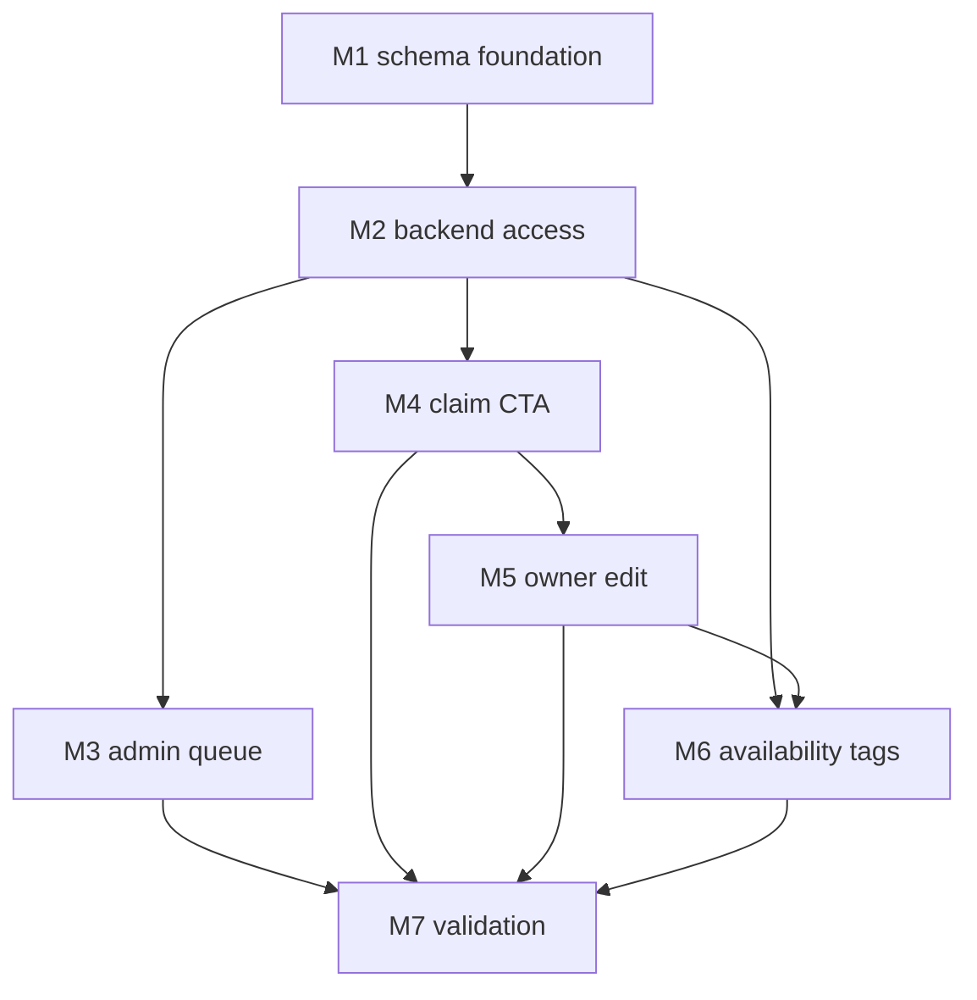

# Manufacturer Accounts & Verification — Execution Roadmap

Backlog entry: [manufacturer-accounts-verification.md](./manufacturer-accounts-verification.md)

## Outcome

Deliver the MVP claim -> admin review -> verified owner editing loop for manufacturer pages. A logged-in user can submit a proof-note claim, an admin can approve/reject/request more info from the existing admin area, and the single verified owner can edit official manufacturer/catalogue content and availability tags.

## Scope boundaries

- Local schema/RLS/storage work is approved, but agents must stop before applying any remote Supabase migration or policy change.
- `manufacturers.adminUser` remains the single-owner source of truth for MVP.
- No multi-owner support, audit/history layer, owner analytics, or module-level purchase/reseller links in this iteration.
- Owner catalogue edits publish immediately.
- Manufacturer logos use app storage uploads, not external image URLs only.

## Execution order

1. [M1 — Schema foundation](./manufacturer-accounts-verification-m1-schema-foundation.md): local migrations, RLS/storage policies, local type generation.
2. [M2 — Backend access layer](./manufacturer-accounts-verification-m2-backend-access.md): Supabase service methods, cache keys, backend tests.
3. [M3 — Admin review queue](./manufacturer-accounts-verification-m3-admin-queue.md): in-app admin claim list and decision controls.
4. [M4 — Manufacturer claim CTA](./manufacturer-accounts-verification-m4-claim-cta.md): claim form/status state machine on manufacturer detail.
5. [M5 — Verified-owner profile/logo edit](./manufacturer-accounts-verification-m5-owner-edit.md): inline owner edit mode for official manufacturer fields and logo upload.
6. [M6 — Module availability tags](./manufacturer-accounts-verification-m6-availability-tags.md): public chips and owner-only tag editor for modules.
7. [M7 — Validation and review](./manufacturer-accounts-verification-m7-validation.md): targeted tests, lint, review, and visual verification.

## Dependency graph

## Current status

M1 is complete: local migrations validated in a disposable Supabase stack, local candidate types
generated, and the M1-safe additions merged into `src/backend/database.types.ts` (2026-07-17; see
[M1 decision log](./manufacturer-accounts-verification-m1-schema-foundation.md#decision-log)).
Remote apply of the M1 migrations remains a separate explicit approval gate.

M2 has not started. An unrelated 2026-07-20 refactor (`bb776507`) incidentally pre-registered the
`manufacturer_claims` and `module_availability_tags` table names in `DatabaseStrings.ts`, but none of
M2's read/create/update/delete/storage methods, cache keys, or integration specs exist yet — M2 is
unblocked and ready to start next.

## Decision log

- 2026-06-18T11:07+02:00 — User approved local-only schema/RLS/storage implementation planning for Manufacturer Accounts & Verification.
- 2026-06-18T11:32+02:00 — M1 drafted local migrations and stopped because local Supabase/Docker was unavailable for type generation.
- 2026-06-18T11:45+02:00 — Execution plan split into dedicated markdown files before any further chunk proceeds.
- 2026-08-11 — Doc hygiene re-verification: this file's "Current status" said type generation was still blocked, but
  M1's own decision log recorded local typegen complete on 2026-07-17. Updated to reflect M1 done / M2 not started
  (see M2 decision log for the supporting `grep` evidence).
